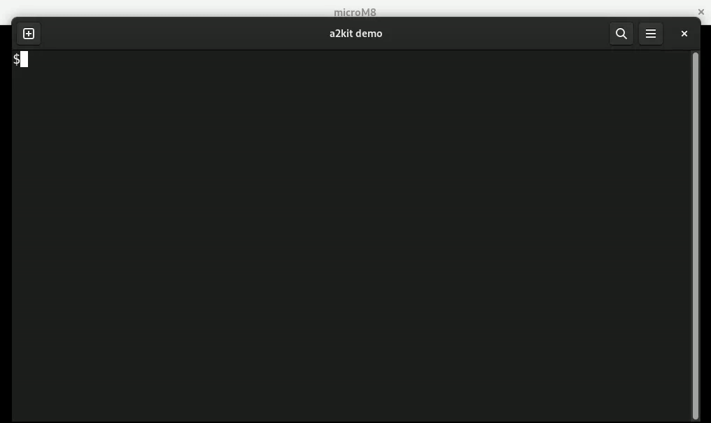

# Apple ][ Kit (a2kit)

Command line interface and library for manipulating Apple ][ language files and disk images.

Here is an example using the CLI to create a disk image that is then loaded into [microM8](https://paleotronic.com/software/microm8/) and booted.  This example assumes the working directory contains ProDOS system binaries (in the `any` format) and Applesoft source code for the greeting program.  In practice one might choose to script such operations.

## Documentation

[Command Line Interface](https://github.com/dfgordon/a2kit/wiki)

[Library Crate](https://docs.rs/a2kit/0.2.0/a2kit/)

